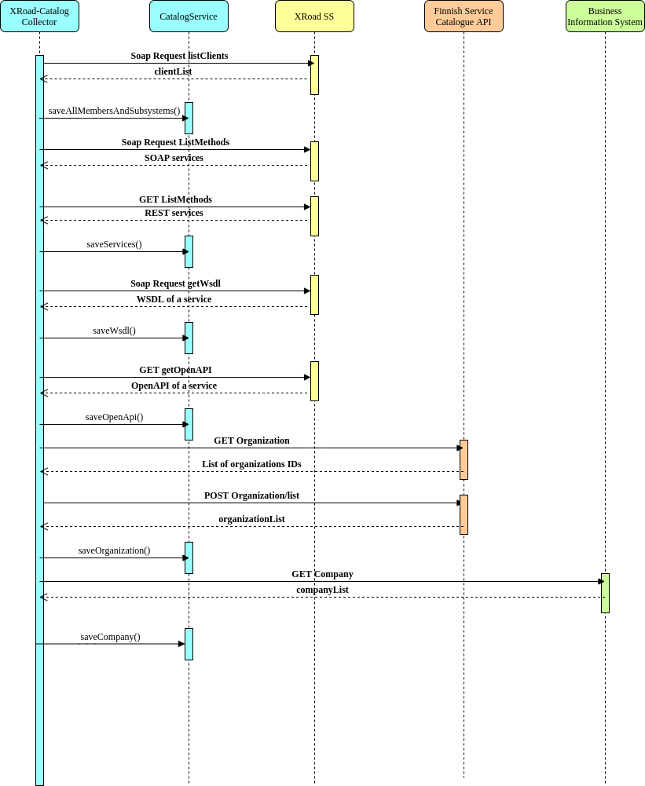

# Collector for X-Road Clients in System

## Introduction to X-Road Catalog Collector

The purpose of this piece of software is to collect members, subsystems and services from the X-Road instance and store them to the PostgreSQL database. 

The software is implemented using concurrent Akka actors: 
* FetchWsdlActor - fetches WSDL descriptions of SOAP services from the X-Road instance and stores them to the db
* FetchOpenApiActor - fetches OpenAPI descriptions of Rest services from the XRoad instance and stores them to the db
* ListClientsActor - fetches a list of clients from the XRoad instance and stores them to the db
* ListMethodsActor - fetches a list of services from the XRoad instance and stores them to the db
* FetchOrganizationsActor - fetches a list of public organizations from an external API and stores them to the db
* FetchCompaniesActor - fetches a list of private companies from an external API and stores them to the db

A sequence diagram illustrating flow between XRoad-Catalog service layer, XRoad-Catalog Collector, 
   XRoad security servers and different third-party apis

## Build

    $ ../gradlew clean build

## Run

    $ ../gradlew bootRun

Or

    $ java -jar target/xroad-catalog-collector-1.0-SNAPSHOT.jar

## Run against remote security server

First create an ssh tunnel to local port 9000, for example

    $ ssh -nNT -L 9000:gdev-rh1.i.palveluvayla.com:80 dev-is.palveluvayla.com

Then run the collector with profile sshtest

    $ java -Dspring.profiles.active=sshtest -jar build/libs/xroad-catalog-collector.jar --spring.config.name=collector,catalogdb

## Build RPM Packages on Non-RedHat Platform

First make sure that xroad-catalog-persistence is located next to xroad-catalog-collector. The RPM build
 uses sql files from xroad-catalog-persistence/src/main/sql.
 
    $ ../gradlew clean build
    $ docker build -t collector-rpm packages/xroad-catalog-collector/docker
    $ docker run -v $PWD/..:/workspace collector-rpm
